# IntelliJ IDEA Remote Development 使用体验

---

前天JetBrains发布新一代IDE —— Fleet，其中由我最感兴趣的是分布式开发，因为本人从事CI/CD 相关工作，所以特地关注了一下。

刚刚今天IDEA 提示更新新版本，看有Remote Development，特来体验一下。

## 准备

本地准备2个项目，分别 Spring Boot、 Android 项目，并且能正确运行，然后上传到git仓库，如Gitlab 或 Github。

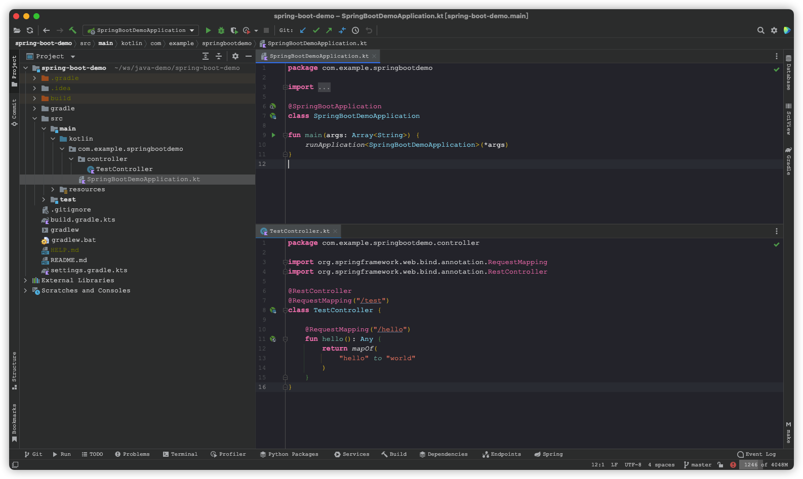

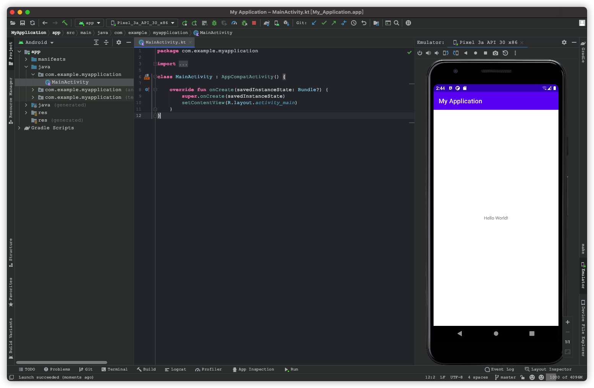

准备一个远程服务器，我这里是Ubuntu，SpringBoot 与Android 编译环境已经预先设置，平常用作实验与打包，机器配置稍微高一点，然后下载以为2个项目代码。

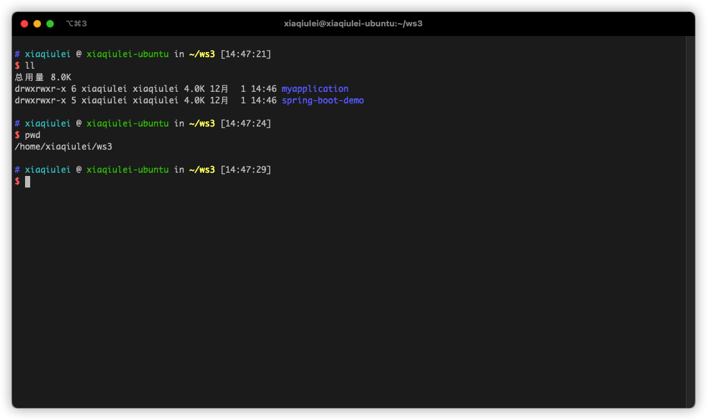

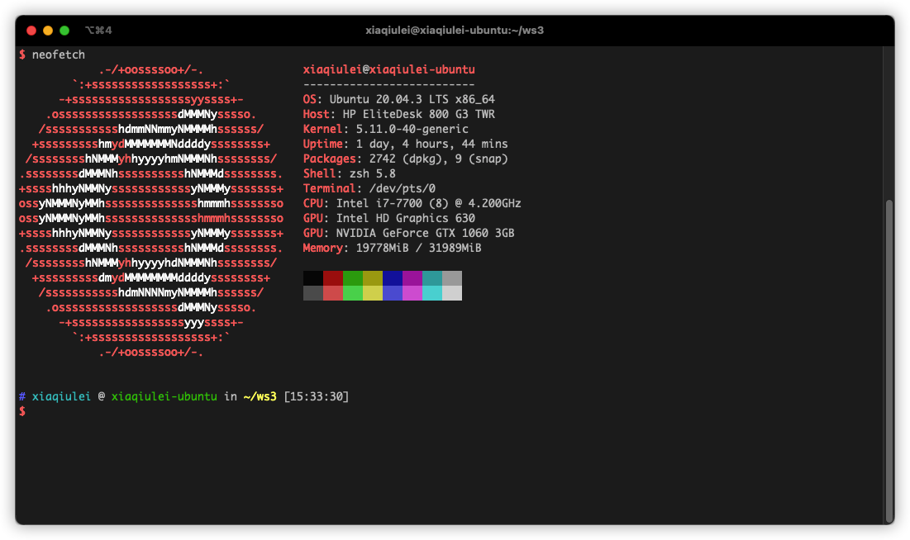

## 使用

下载或者更新到最新的IDEA，我这里是2021.3。打开就会有 Remote Development功能。

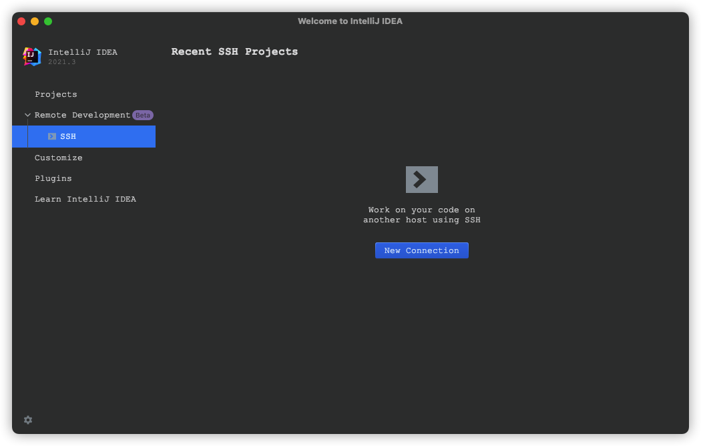

然后使用ssh连接到远程服务器，先测试spring-boot项目。

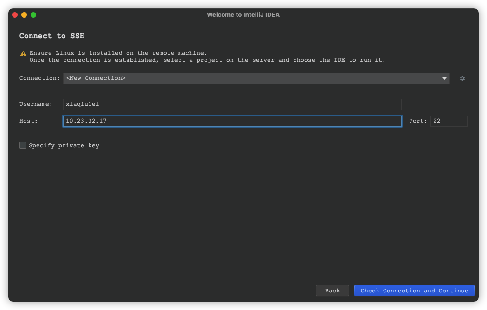

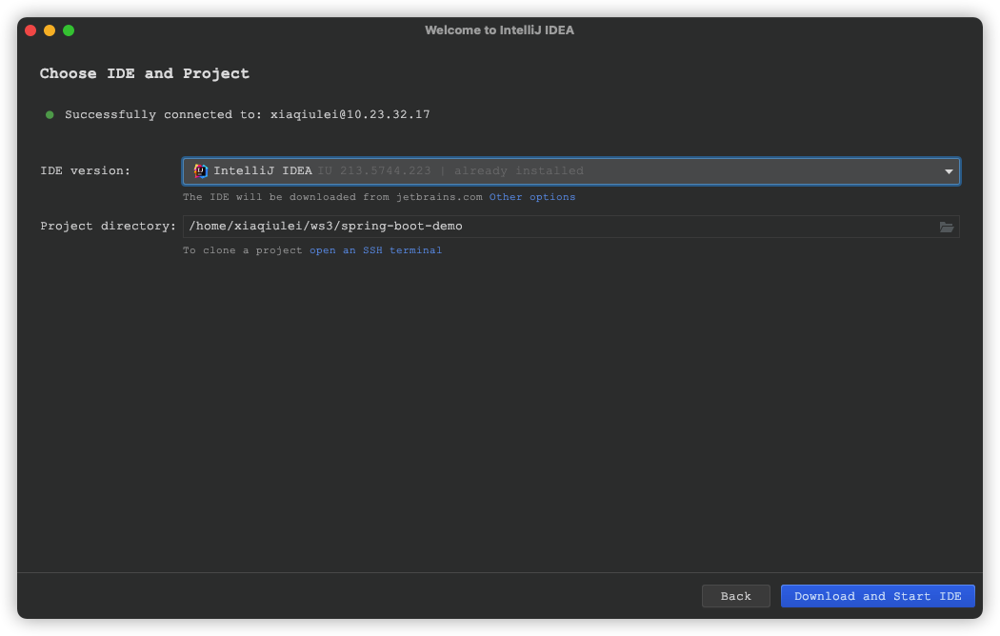

IDE VERSION 选择 IntelliJ IDEA，最后选择下载和启动，因为我预先测试过，所以我这里显示 `Installed`。

我这边启动失败，但是打开启动界面是有记录的，直接打开即可。

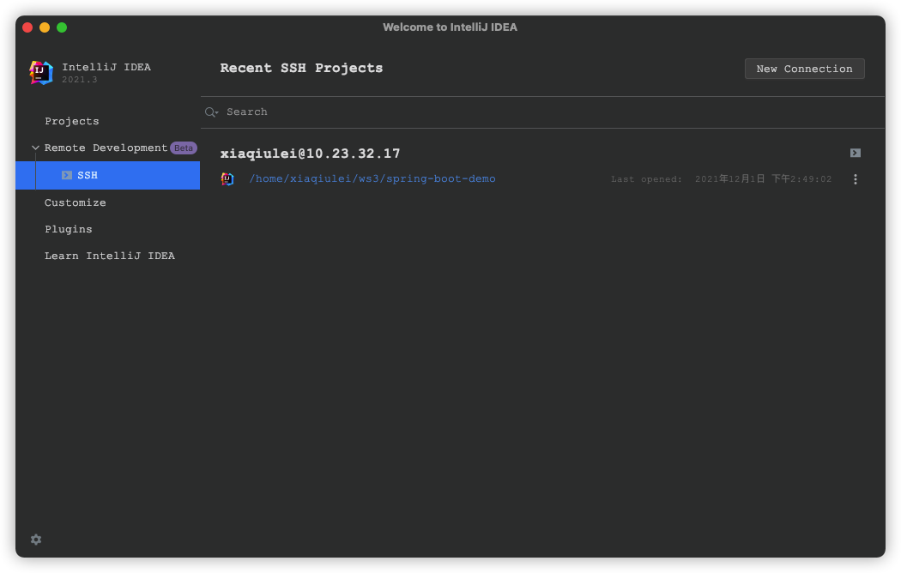

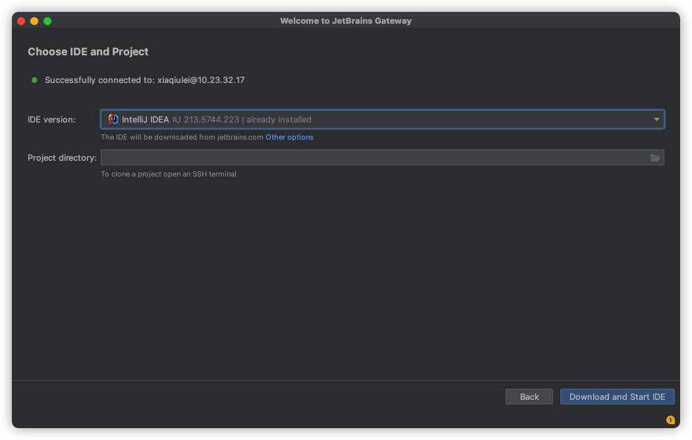

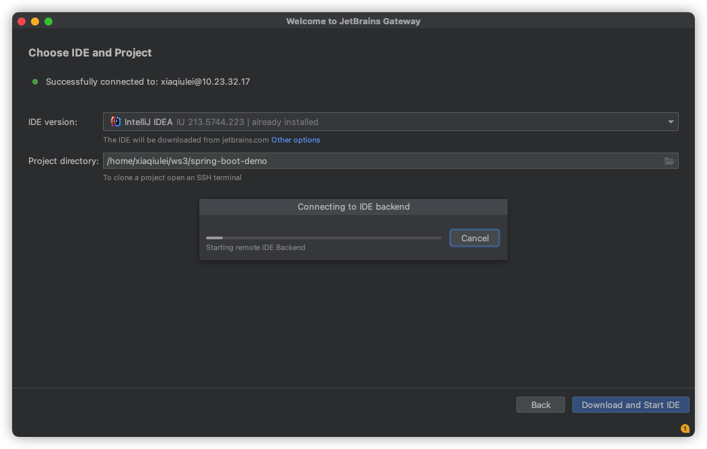

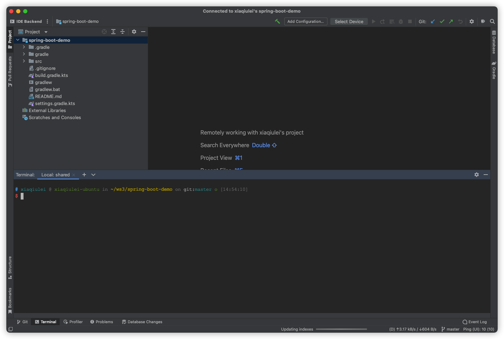

开始加载和建立索引，此过程比较差，不知道是我的机器性能问题，还是网络问题，有点卡顿。

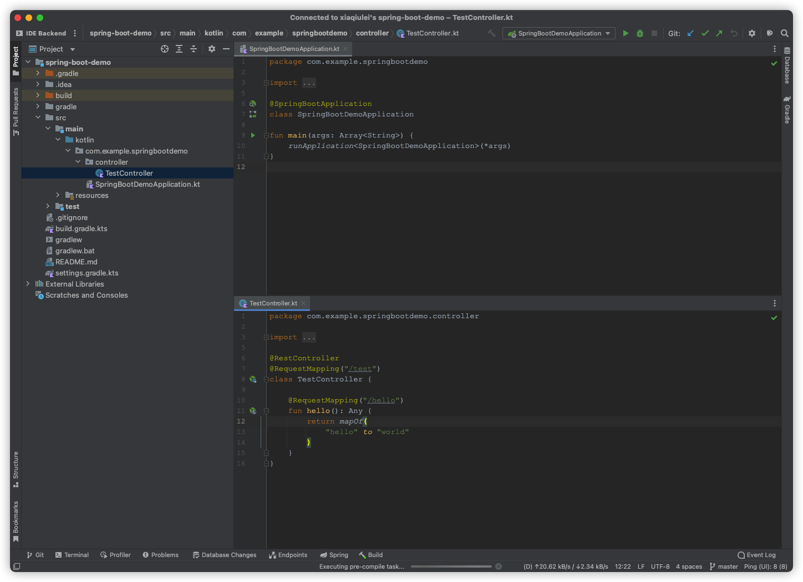

运行与测试。

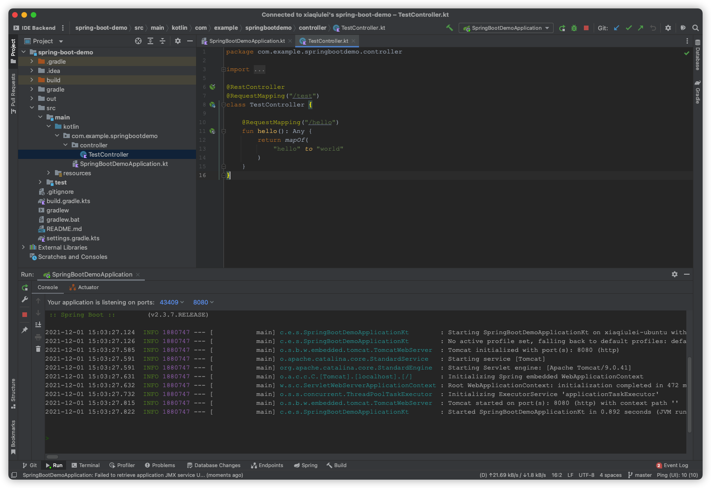

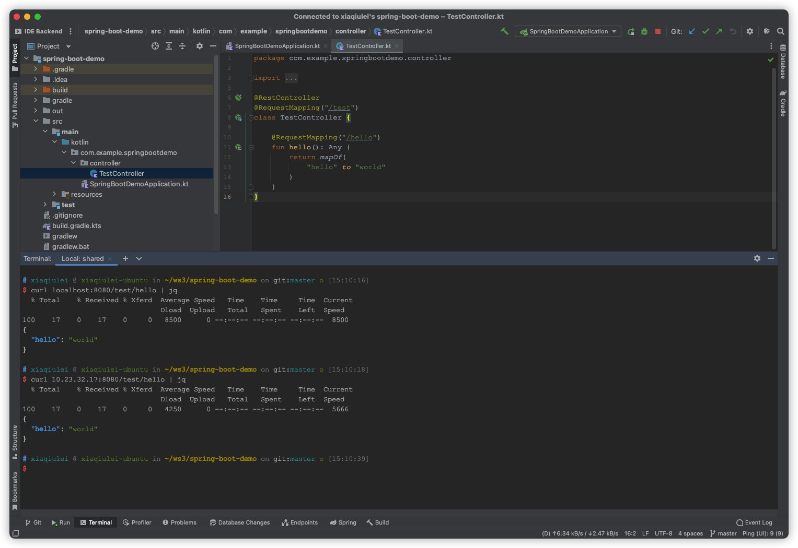

远程使用localhost，本地使用IP直连。

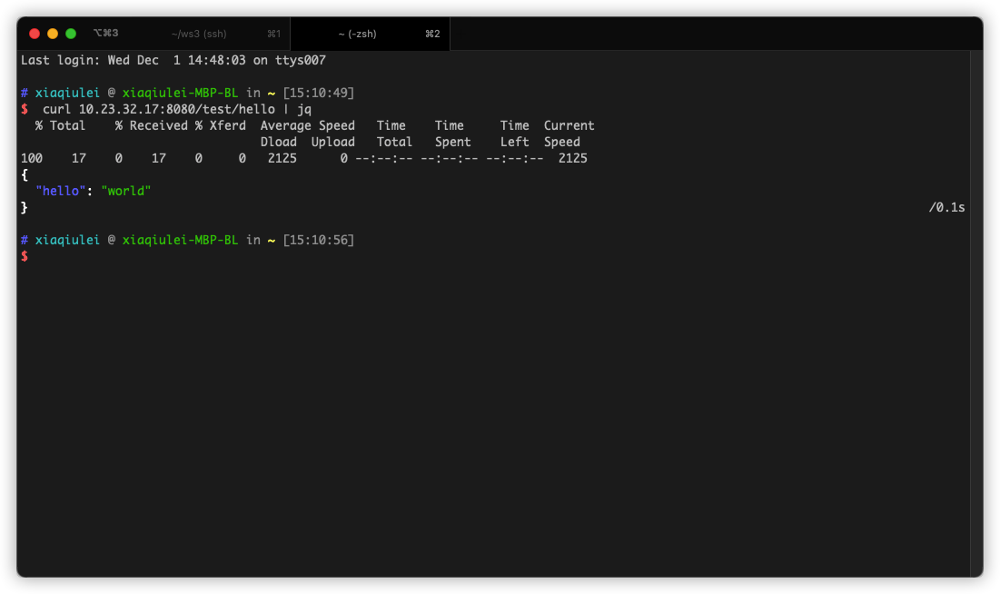

## Android 测试

根据以上步骤，打开Android测试项目。

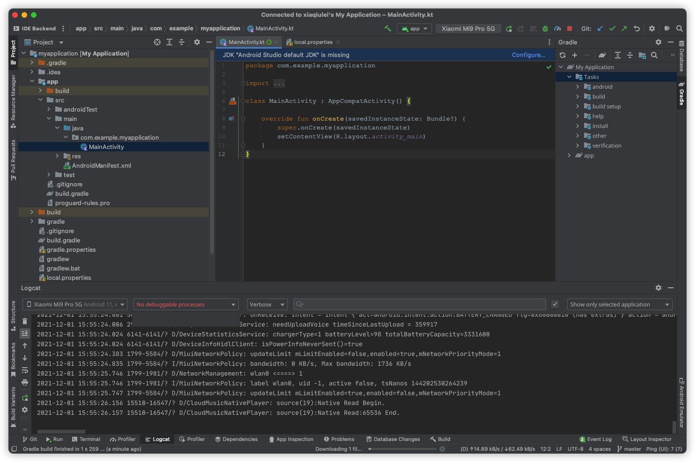

结果可以编译与识别手机，但是无法安装apk，不知道是不是bug。

## 总结

界面显示是Beta功能，确实好多功能不太稳定，经常出现奔溃与卡顿现象。 运行Spring Boot 项目是成功的，Android有点问题，总体来说体验不错。

以前也用过code-server与vscode 的 Remote Development，相比而言IDEA 的remote development有天然的优势，代码提示语使用体验基本与本地一直。
因为本人从事Android与java开发，IDEA的提示功能还是强依赖的，纯文本编译器来开发还是有压力的 。